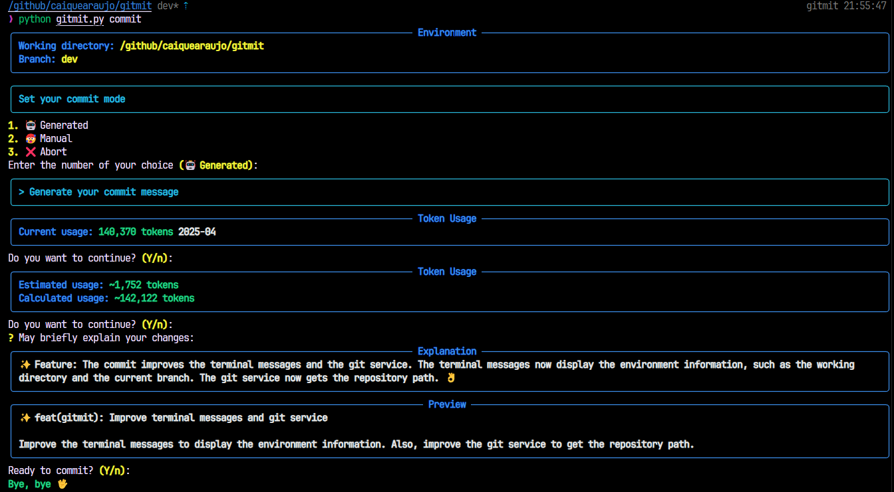

# Gitmit

 [](LICENSE)



Gitmit is a powerful Git repository manager that helps you maintain clean and consistent commit messages using AI-powered commit message generation. It follows GitFlow requirements and provides a standardized way to manage your Git repositories.

## Features

- 🤖 AI-powered commit message generation using Google's Gemini or Ollama;
- 📝 Standardized commit message format with emojis and types;
- 🔄 Automatic branch management following GitFlow;
- 📊 Token usage tracking for AI services;
- 📝 (optional) Summarize changes in the current branch to not share the entire commit history with external AI models;
- 🔧 Easy configuration and setup.

## Details

### Summarization

The summarization feature is optional and can be enabled by setting the `models.resume` model in the configuration file.

The main goal for this feature is to not share the entire commit history with external AI models, but only the summarized changes in the current branch.

You should have `ollama` installed to use this feature.

> When the `models.commit` is set to `ollama/...`, the summarization will be ignored.

### Token Usage

The token usage is tracked in a MySQL database. It will be started automatically, so it's a **must set** configuration.

The main goal for this feature is keeping track the token usage across different devices. You choose a database, and anytime you use the tool, the token usage will be updated and synced accordingly.

## Installation

### From Release

1. Download the latest release file from the [GitHub releases page](https://github.com/caiquearaujo/gitmit/releases)
2. Move the downloaded file to `/usr/local/bin/gitmit`
3. Make the file executable:
   ```bash
   chmod +x /usr/local/bin/gitmit
   ```

### From Source

1. Clone the repository:
   ```bash
   git clone https://github.com/caiquearaujo/gitmit.git
   cd gitmit
   ```
2. Create and activate a virtual environment:
   ```bash
   python -m venv .venv
   source .venv/bin/activate  # On Windows: .venv\Scripts\activate
   ```
3. Install dependencies:
   ```bash
   pip install -r requirements.txt
   ```
4. Build the executable:
   ```bash
   pyinstaller --onefile gitmit.py
   ```
5. Create a symbolic link:
   ```bash
   sudo ln -s $(pwd)/dist/gitmit /usr/local/bin/gitmit
6. Make the file executable:
   ```bash
   chmod +x /usr/local/bin/gitmit
   ```

## Configuration

1. Run the config command to generate the configuration file:
   ```bash
   gitmit config
   ```
2. The configuration file will be created at `~/.config/gitmit/config.ini`. Edit it with your preferred text editor.

### Configuration Options

#### Models Section
```ini
[models]
# Required: The model to use for commit message generation
# Format: service/model (e.g., google/gemini-2.0-flash or ollama/codellama)
commit = google/gemini-2.0-flash

# Optional: The model to use for change summarization
# Leave empty to disable
resume = ollama/codellama
```

#### Google Section
```ini
[google]
# Required if using Google models: Your Google API key
api_key = your-api-key-here
```

#### Ollama Section
```ini
[ollama]
# Required if using Ollama models: The Ollama server URL
host = http://localhost:11434
```

#### MySQL Section
```ini
[mysql]
# Required: Database connection settings for token usage tracking
host = localhost
port = 3306
user = root
password = your-password
database = gitmit
```

## Usage

### Initialize a Repository

```bash
gitmit init [options]
```

Options:
- `--dev`: Create a dev branch (GitFlow);
- `--origin`: Set the origin URL for the remote repository.

Example:
```bash
gitmit init --dev --origin https://github.com/username/repo.git
```

### Commit Changes

```bash
gitmit commit [options]
```

Options:
- `--push`: Automatically push changes to the remote repository;
- `--force`: Skip confirmation before committing.

Example:
```bash
gitmit commit --push
```

When committing, you'll be presented with two options:
1. 🤖 Generated: AI will analyze your changes and generate an appropriate commit message;
2. 🥵 Manual: You can manually create a commit message following the standardized format.

### Commit Types

Gitmit supports various commit types with corresponding emojis:

| Emoji | Type | Description |
|-------|------|-------------|
| ✨ | feat | New features |
| 🩹 | fix | General fixes |
| 🐞 | bug | Bug fixes |
| 📚 | docs | Documentation changes |
| 💎 | style | Code style changes |
| 📦 | refactor | Code refactoring |
| 🐎 | perf | Performance improvements |
| ♻️ | improvement | General improvements |
| ✅ | test | Test changes |
| 🚨 | lint | Linter fixes |
| 🔧 | build | Build changes |
| ⚙️ | ci | CI changes |
| ♻️ | chore | Maintenance tasks |
| ⏪ | revert | Reverting changes |
| ⏫ | dependencies | Dependency updates |
| 📇 | metadata | Metadata changes |
| 🔖 | version | Version updates |
| 🔒 | security | Security fixes |
| 🚑 | critical | Critical changes |
| 👌 | review | Code review changes |
| 🧱 | other | Other changes |


## Upgrades & Integrations

Follow the [Release Notes](https://github.com/caiquearaujo/gitmit/releases) to keep your project up-to-date.

## Community & Contributions

The community and core team are available in [GitHub Discussions](https://github.com/caiquearaujo/gitmit/discussions), where you can ask for support, discuss roadmap, and share ideas.

Our [Contribution Guide](https://github.com/caiquearaujo/gitmit/blob/dev/CONTRIBUTING.md) describes how to contribute to the codebase and docs.

## Credits

- [Caique Araujo](https://github.com/caiquearaujo)
- [All contributors](../../contributors)

## License

MIT. See [LICENSE](LICENSE).